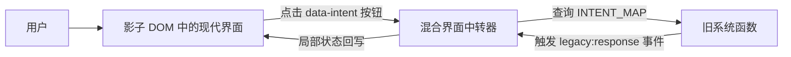

# 旧页面迁移

这是一个 TrojanUI 概念验证项目：保留旧系统的业务函数，用现代界面接管页面可见部分，并用对照组展示普通直接插入方案为什么会被旧系统样式污染。

技术栈刻意保持极简：原生 HTML、CSS、JavaScript。没有 React，没有 Vue，没有打包工具，也不需要安装依赖。

## 这个项目验证什么

这个项目回答一个问题：

> 不重写旧业务函数，现代界面能不能安全接管一个老旧内网页面？

演示页面会保留旧的 `window.legacyApp.v1.*` 函数，隐藏丑陋的旧系统 DOM，通过影子 DOM 挂载新界面，并用意图路由表把按钮点击转发到旧系统函数。

## 预览页面

建议先打开 `index.html`。它是三种预览入口的首页：

| 预览 | 页面 | 观察重点 |
| --- | --- | --- |
| 预览 1 | `legacy_system.html?legacy=1` | 原始旧 ERP 页面：表格布局、宋体、棕色文字、恶意全局样式。 |
| 预览 2 | `legacy_system.html` | TrojanUI 实验组：现代深色界面通过影子 DOM 接管页面。 |
| 预览 3 | `experiment_control.html` | 对照组：同一套现代界面直接插入旧页面，因此被旧系统样式污染。 |

如果仓库开启了 GitHub Pages，预览入口是：

```text
https://ice348839086.github.io/old-html-moving/
```

本地测试命令：

```bash
python -m http.server 8765 --bind 127.0.0.1
```

然后打开：

```text
http://127.0.0.1:8765/
```

## 文件说明

| 文件 | 用途 |
| --- | --- |
| `index.html` | 三个可视化预览入口首页。 |
| `legacy_system.html` | 主实验页，模拟带有强全局样式污染的旧内网 ERP。 |
| `hib_broker.js` | 混合界面中转器，负责隐藏旧 DOM、挂载影子 DOM、路由意图、回写状态。 |
| `modern_ui.js` | 现代界面模板，实验组和对照组共用。 |
| `modern_ui.css` | 深色卡片现代界面样式，在实验组中注入影子 DOM。 |
| `experiment_control.html` | 对照组页面，不使用影子 DOM，直接插入同一套现代界面。 |

## 测试流程

1. 打开 `legacy_system.html?legacy=1`。
2. 观察原始旧 ERP 页面，这是基线。
3. 打开 `legacy_system.html`。
4. 确认深色现代界面没有受到旧页面 `SimSun` 和 `brown !important` 全局样式影响。
5. 在物料编码输入框中输入一个值，点击“查询库存”，确认旧系统弹窗能收到这个新值。
6. 点击“创建订单”，确认第二个旧系统函数也能通过同一个中转器被调用。
7. 每次关闭弹窗后，查看状态区是否更新了“最近意图、最近输入值、最近同步”。
8. 打开 `experiment_control.html`，对比直接插入方案被污染后的效果。

## 为什么有三个页面

三个页面用于快速视觉对比：

- `legacy_system.html?legacy=1` 展示接管前的旧系统。
- `legacy_system.html` 展示影子 DOM 接管后的实验组。
- `experiment_control.html` 展示为什么普通直接插入方案不够用。

## 架构



关键边界来自 `hib_broker.js` 中创建的影子 DOM 根节点：

```javascript
const shadowRoot = host.attachShadow({ mode: "open" });
```

因为现代界面位于这个边界内部，旧页面下面这种全局样式无法改写现代界面内部节点：

```css
* {
  font-family: "SimSun", serif !important;
  color: brown !important;
}
```

## 实现要点

### 旧 DOM 隐藏

`hib_broker.js` 会隐藏旧系统的可见界面，但保留旧系统 JavaScript 函数可调用：

```javascript
legacyApp.setAttribute("aria-hidden", "true");
legacyApp.style.display = "none";
```

### 意图路由层

中转器使用路由表，而不是写死一堆 `if` 分支：

```javascript
const INTENT_MAP = {
  "inventory.query": { namespace: "legacyApp.v1", handler: "legacyQueryAction" },
  "order.create": { namespace: "legacyApp.v1", handler: "legacyOrderAction" }
};
```

现代界面内部按钮通过 `data-intent` 声明目标意图，中转器再把这个意图反射调用到对应旧系统函数。

### 双向状态同步

旧系统函数执行完成后会发出响应事件：

```javascript
window.dispatchEvent(new CustomEvent("legacy:response", { detail }));
```

中转器监听这个事件，只更新影子 DOM 内部的现代界面状态区。

## 论文截图素材

建议为论文截取以下图片：

| 截图 | 文件 / 操作 | 建议章节 |
| --- | --- | --- |
| 原始旧界面 | 打开 `legacy_system.html?legacy=1` | 第 1 章：引言 |
| TrojanUI 接管效果 | 打开 `legacy_system.html` | 第 4 章：系统实现 |
| 影子 DOM 树结构 | 开发者工具 -> 元素 -> `#hib-root` -> `#shadow-root (open)` | 第 3 章：系统架构 |
| 对照组污染效果 | 打开 `experiment_control.html` | 第 5 章：实验评估 |
| 实验组隔离效果 | 将 `legacy_system.html` 与对照组并排比较 | 第 5 章：实验评估 |

## 论文映射

| 代码产物 | 论文章节 |
| --- | --- |
| `legacy_system.html` | 3.1 旧系统模型 |
| `hib_broker.js` | 3.2 中转器架构 |
| `INTENT_MAP` | 3.3 意图路由层 |
| `legacy:response` 事件处理 | 3.4 双向状态同步 |
| `experiment_control.html` | 5.1 对比实验 |

## 可写入论文的实验结论

可以把对照组作为基线，把影子 DOM 页面作为实验组：

> 在恶意全局样式污染下，直接插入 HTML 的方案会继承旧系统强制字体和颜色规则；而基于影子 DOM 的 TrojanUI 方案可以保持预期的字体、颜色、布局和组件层级。

如果要写成更强的定量实验，可以准备 10 组恶意全局样式，分别记录对照组和实验组中可见组件被破坏的比例。
