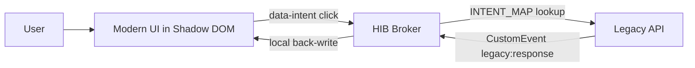

# Old HTML Moving

Old HTML Moving is a small TrojanUI proof of concept: keep the legacy business logic, replace the visible page with a modern Shadow DOM interface, and compare it with a broken direct-HTML embedding baseline.

The stack is intentionally boring: plain HTML, CSS, and JavaScript. No React, no Vue, no bundler, no install step.

## What This Demonstrates

This project answers one question:

> Can a modern UI safely take over an old internal HTML page without rewriting the old business functions?

The demo keeps the old `window.legacyApp.v1.*` functions alive, hides the ugly legacy DOM, mounts a new interface through Shadow DOM, and routes button clicks back into the old functions through an intent map.

## Preview Pages

Open `index.html` first. It is a landing page with three preview cards:

| Preview | Page | What to Look For |
| --- | --- | --- |
| Preview 1 | `legacy_system.html?legacy=1` | The original old ERP page with table layout, SimSun font, brown text, and hostile global CSS. |
| Preview 2 | `legacy_system.html` | The TrojanUI experiment. A modern dark UI takes over the page through Shadow DOM. |
| Preview 3 | `experiment_control.html` | The control group. The same modern UI is injected with `innerHTML` and gets polluted by legacy CSS. |

If this repository is served by GitHub Pages, the preview entry is:

```text
https://ice348839086.github.io/old-html-moving/
```

For local testing:

```bash
python -m http.server 8765 --bind 127.0.0.1
```

Then open:

```text
http://127.0.0.1:8765/
```

## Files

| File | Purpose |
| --- | --- |
| `index.html` | Landing page with three visual preview entries. |
| `legacy_system.html` | Main experiment page. Simulates an old intranet ERP with aggressive global CSS pollution. |
| `hib_broker.js` | Hybrid Interface Broker. Hides the legacy DOM, mounts Shadow DOM, routes intent, and back-writes legacy state. |
| `modern_ui.js` | Reusable modern UI template shared by the experiment and control pages. |
| `modern_ui.css` | Dark-card modern UI stylesheet injected inside Shadow DOM. |
| `experiment_control.html` | Control page. Injects the same modern UI through plain `innerHTML`, without Shadow DOM. |

## Test Flow

1. Open `legacy_system.html?legacy=1`.
2. Observe the original old ERP page. This is the baseline.
3. Open `legacy_system.html`.
4. Confirm that the dark modern UI is not affected by the legacy page's `SimSun` and `brown !important` global CSS.
5. Enter a value in `Material code`, click `Query Stock`, and confirm that the legacy alert receives the new value.
6. Click `Create Order` and confirm that the second legacy function is routed through the same broker.
7. After each alert, check that `#modern-status`, `Last intent`, `Last value`, and `Last sync` update inside the modern UI.
8. Open `experiment_control.html` and compare the polluted direct-embedding result.

## Why Three Pages

The three pages are designed for quick visual comparison:

- `legacy_system.html?legacy=1` shows what the old system looked like before takeover.
- `legacy_system.html` shows the proposed Shadow DOM takeover.
- `experiment_control.html` shows why plain `innerHTML` embedding is not enough.

## Architecture



The important boundary is the Shadow DOM root created in `hib_broker.js`:

```javascript
const shadowRoot = host.attachShadow({ mode: "open" });
```

Because the modern interface lives inside that boundary, the legacy page-level CSS rule below cannot restyle its internal nodes:

```css
* {
  font-family: "SimSun", serif !important;
  color: brown !important;
}
```

## Implementation Notes

### DOM Erasure

`hib_broker.js` hides the visual legacy application while leaving the JavaScript API available:

```javascript
legacyApp.setAttribute("aria-hidden", "true");
legacyApp.style.display = "none";
```

### Intent Routing Layer

The broker uses a routing table instead of hard-coded `if` branches:

```javascript
const INTENT_MAP = {
  "inventory.query": { namespace: "legacyApp.v1", handler: "legacyQueryAction" },
  "order.create": { namespace: "legacyApp.v1", handler: "legacyOrderAction" }
};
```

Buttons inside the modern UI declare their target through `data-intent`, then the broker reflects that intent into the matching legacy function.

### Bidirectional State Sync

Legacy functions emit a response event after finishing:

```javascript
window.dispatchEvent(new CustomEvent("legacy:response", { detail }));
```

The broker listens to that event and updates only the modern UI status area inside the Shadow DOM.

## Evaluation Screenshots

Capture these screenshots for the paper:

| Screenshot | File / Action | Suggested Chapter |
| --- | --- | --- |
| Original old interface | Open `legacy_system.html?legacy=1` | Chapter 1: Introduction |
| TrojanUI takeover result | Open `legacy_system.html` | Chapter 4: Implementation |
| Open Shadow DOM tree | DevTools -> Elements -> `#hib-root` -> `#shadow-root (open)` | Chapter 3: Architecture |
| Control group pollution | Open `experiment_control.html` | Chapter 5: Evaluation |
| Experiment group isolation | Open `legacy_system.html` next to the control page | Chapter 5: Evaluation |

## Paper Mapping

| Code artifact | Paper section |
| --- | --- |
| `legacy_system.html` | 3.1 Legacy System Model |
| `hib_broker.js` | 3.2 HIB Architecture |
| `INTENT_MAP` | 3.3 Intent Routing Layer |
| `legacy:response` event handling | 3.4 Bidirectional State Sync |
| `experiment_control.html` | 5.1 Comparative Experiment |

## Suggested Evaluation Claim

Use the control page as the baseline and the Shadow DOM page as the experimental group:

> Under hostile global CSS pollution, direct `innerHTML` embedding inherits the legacy system's forced font and color rules, while the Shadow DOM-based TrojanUI interface preserves its intended typography, color, layout, and component hierarchy.

For a stronger quantitative section, repeat the comparison with 10 hostile global CSS rules and record the percentage of visible component breakage in the control and experimental groups.
